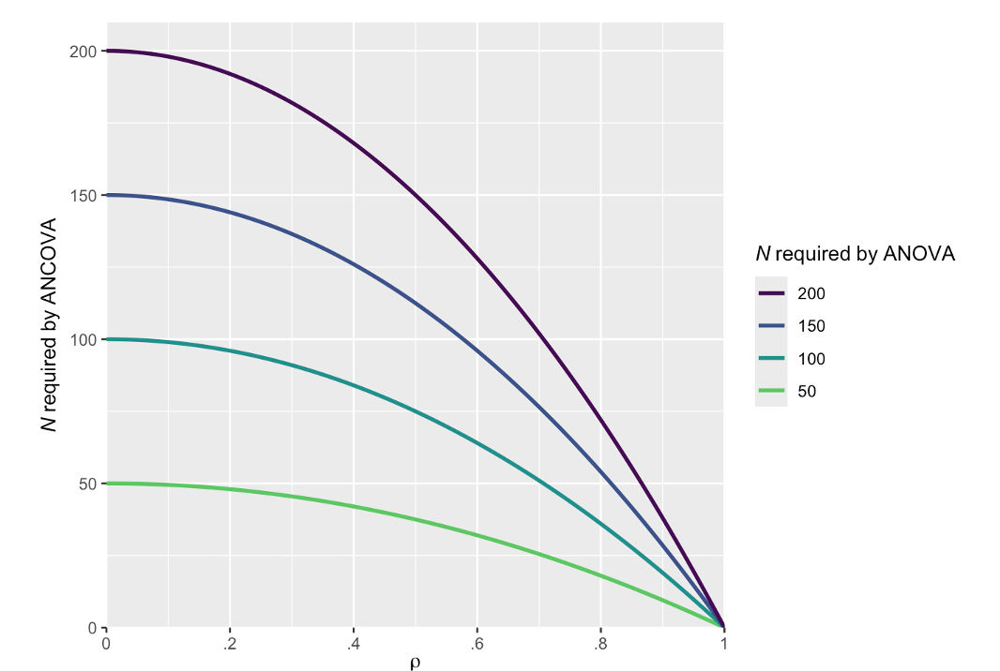

## Possible outcomes

|   | **Detection (Positive Result)** | **Null Result (Negative Result)** |
|----|----|----|
| **Effect Present (H₁)** | **True Positive** <br>Correct detection | **False Negative** <br>Type II Error ($\beta$) |
| **Effect Absent (H₀)** | **False Positive** <br>Type I Error ($\alpha$) | **True Negative** <br>Correct rejection |

## How to decrease the probability of a Type II error?

By increasing the statistical power of the study design

## Statistical power

- Power can be defined as the probability of correctly detecting a true effect when it exists (1 − $\beta$)

- In frequentist statistics, it can be understood as the proportion of times we will obtain a significant result if the experiment is repeated many times.

- For example, if an experiment is repeated 100 times with 80% power, we expect to find a significant effect in approximately 80 out of those 100 studies.

## Visualizing power in the long term

- Suppose we repeat the same study 1000 times with 80% power to detect a true effect size of 0.2.

- Out of these 1000 studies, about 800 (\~80%) would yield a significant *p*-value.

{fig-align="center"}

## Visualizing power in a single study


<https://rpsychologist.com/d3/nhst/>

## Factors affecting statistical power

- Effect size: The larger the effect size, the larger the statistical power

- Sample size: the larger the sample size, the higher the statistical power

- $\alpha$: Lowering $\alpha$ reduces power

- Study design (between-subject vs. within-subject designs):

  - **Within-subject designs** (repeated measures) tend to have more power than **between-subject designs** because they reduce variability by comparing subjects to themselves.

## Factors determining sample size

- Increasing mean difference or reducing the standard deviation (SD) increases effect size

  $$d = \frac{\text{mean difference}}{\text{SD}}$$

<!-- -->

- Directional vs. non-directional tests:

  - **One-tailed (directional)** tests have more power to detect an effect in one direction but **cannot** detect effects in the opposite direction.

  - **Two-tailed (non-directional)** tests are more conservative and split alpha across two tails, reducing power slightly for a given effect in one direction.

## Factors determining statistical power

- Adding baseline covariates to an ANOVA model-resulting in an ANCOVA model-will generally increase power compared to an ANOVA model.

- ANCOVA adjusts for baseline differences between groups, reducing residual variance and thereby increasing the sensitivity to detect group differences

## ANCOVA vs. ANOVA



# Why high statistical power is a desired property?

## Increase the informatoinal value of studies

- Consider a study designed with **40% statistical power**. Such a study has a lower probability of detecting a true effect than a coin flip has of landing heads.

- If a study is designed with only **40% power**, a non-significant result is generally difficult to interpret because it could reflect either:

  - The absence of a true effect (or an effect smaller than anticipated), **or**

  - Insufficient power to detect an effect that actually exists.

\##

As a result, low-powered studies often produce **uninformative non-significant findings**. A failure to reject the null hypothesis may simply indicate that the study lacked the ability to detect meaningful effects, rather than providing evidence that no effect exists

## Improved precision (narrower 95% CI)

{width="500"}

# Type of power analysis

## A priori power analysis

- Input: power, effect size, statistical test and $\alpha$

- Output: sample size

- Answers the question: Given an effect size, what is the minimum sample size required to achieve the desired level of power?

## Sensitivity analysis

- Input: power, sample size, statistical test and $\alpha$

- Output: effect size

- Useful when sample size is fixed due to resource constraints. For example:

  - A researcher interested in studying a very small population (Olympic athletes)

  - Financial and time constraints

- It answers the question: Given my sample size, what is the smallest significant effect size that I can detect with adequate power?

## Conducting a sensitivity analysis

- Hypothesis = Intervention A ≠ Intervention B

- Sample size = 200

- Desired level of power = 0.9

- Study design = between-subject

## Example of sensitivity analysis

Given a sample size, statistical power, statistical test and $\alpha$, what is the smallest signficcant effect size that the study design could detect?

```{r}
#| code-overflow: wrap

res <- pwr::pwr.t.test(n = 100, 
                       sig.level = 0.05, 
                       power = 0.9, 
                       type = "two.sample", 
                       alternative = "two.sided")

round(res$d, 2)
```

## Post hoc power analysis

- Input: observed effect size, sample size, statistical test and $\alpha$

- Output: observed power

- It is bad practice: it does not add any information beyond the reported *p* value, but it presents the same information in a different way. The *p* value observed is directly related to the observed power

## Post hoc power analysis

- If the p value is non-significant (i.e., larger than 0.05) the observed power will be less than approximately 50% in a *t*-test


# Effect size justification

## Smallest Effect Size of Interest

- The smallest effect size that is considered theoretically and practically interesting.

- Best justification

- Very difficult to establish

## Expected effect size

- Most common approach

- Researchers use a previous study or meta-analysis to select their effect size

- Caveats:

  - Inflated effect sizes due to publication bias and studies with underpowered designs; and

  - Researchers need to take into account the research context of the studies (PICOS: Population, Intervention, Comparator, Outcome, Study design)

## PICOS

- **Population:** Is your target population the same as, or comparable to, the population studied in the original research?

- **Intervention:** Is the intervention evaluated in the original study similar to the intervention of interest?

- **Comparison:** Is the comparison or control group in the original study similar to the comparison relevant to your research question?

- **Outcome:** Is the primary outcome measured in the original study similar to your outcome of interest?

- **Study Design:** Is the study design used in the original research appropriate and comparable to the design needed to address your research question?

## The PICOS dimensions need to be taken into account when selecting an effect size from a previous study

## Cohen's *d* thresholds

- Cohen's *d* thresholds were derived from studies from the Social Sciences

  - *d* \< 0.2 (small)

  - *d* \< 0.5 (medium)

  - *d* \> 0.5 (large)

- It ignore the research context (PICOS) of the study

- Suppose you want to test the difference between two treatments on depression. Does it make sense to justify the expected difference based on Cohen's *d* psychology thresholds?

# A priori power analysis for simple designs

```{r echo = FALSE}
library(pwr)        # conduct power analysis for t-tests and correlations
library(Superpower) # conduct power analysis for factorial designs
library(emmeans)    # perform pairwise comparisons
library(TOSTER)     # conduct power analysis for equivalence tests
library(knitr)      # tidy tables
library(faux)       # simulate data
```

## Pearson's correlation test

- Hypothesis: Condition A related to Condition B

- Pearson's correlation *r* = 0.4

- Study design = pre-post (within-subject)

- Desired level of power = 90%

- What is the required sample size?

```{r}
res <- pwr.r.test(r = 0.4, 
                  sig.level = 0.05, 
                  power = 0.9, 
                  alternative = "two.sided")

ceiling(res$n) # use ceiling to round up the sample size
```

## Pearson's correlation test

- Hypothesis: Condition A positively related to Condition B

- Pearson's correlation *r* = 0.4

- Study design = pre-post (within-subject)

- Desired level of power = 90%

- What is the required sample size?

```{r}
res <- pwr.r.test(r = 0.4, 
                  sig.level = 0.05, 
                  power = 0.9, 
                  alternative = "greater")

ceiling(res$n) # use ceiling to round up the sample size
```

## Two-sided paired *t*-test

- Hypothesis: Intervention A ≠ Intervention B

- Cohen's *d~rm~* = 0.2

- Study design = pre-post (within-subject)

- Desired level of power = 90%

- What is the required sample size?

```{r}
res <- pwr.t.test(d = 0.2, 
                  sig.level = 0.05, 
                  power = 0.9, 
                  type = "paired", 
                  alternative = "two.sided")

ceiling(res$n) # use ceiling to round up the sample size
```

## One-sided paired *t*-test

- Hypothesis: Intervention A \> Intervention B

- Cohen's *d~rm~* = 0.2

- Study design = pre-post (within-subject)

- Desired level of power = 90%

- What is the required sample size?

```{r}
res <- pwr.t.test(d = 0.2, 
                  sig.level = 0.05, 
                  power = 0.9, 
                  type = "paired", 
                  alternative = "greater")

ceiling(res$n) # use ceiling to round up the sample size
```

## Two-sided unpaired *t*-test

- Hypothesis: Intervention A ≠ Intervention B (i.e., non-directional)

- Cohen's *d~s~* = 0.2

- Study design = between subject

- Desired level of power = 90%

- What is the required sample size?

```{r}
res <- pwr.t.test(d = 0.2, 
                  sig.level = 0.05, 
                  power = 0.9, 
                  type = "two.sample", 
                  alternative = "two.sided")

ceiling(res$n) # use ceiling to round up the sample size
```

## One-sided unpaired *t*-test

- Hypothesis: Intervention A \> Intervention B (i.e., directional)

- Cohen's *d~s~* = 0.2

- Study design = between subject

- Desired level of power = 90%

- What is the required sample size?

```{r}
res <- pwr.t.test(d = 0.2, 
                  sig.level = 0.025, 
                  power = 0.9, 
                  type = "two.sample", 
                  alternative = "greater")

ceiling(res$n) # use ceiling to round up the sample size
```

## Power analysis for factorial designs

- Two or more groups/conditions

- `Superpower` package

- Unlike other R packages/software, `Superpower` does not require a standardized effect size as input (e.g., Cohen's *d* ) but a raw effect size)

## How does `Superpower` work?

We first need to simulate data given a study design:

- `ANOVA_design()`: simulates a dataset given:

  - `mu`: expected group means

  - `sd`: group standard deviation

  - *`r`*: correlation between repeated measures (only required if there are repeated measures)

  - `n`: sample size per group/condition

  - `labelnames`: assigns names to factors and groups

# 

We then can estimate statistical power in two ways:

- `ANOVA_exact()` computes power given the specified study design

- `ANOVA_power()` estimates statistical power using Monte Carlo simulations, typically yielding similar results

::: callout-note
Monte Carlo simulations: repeatedly simulates datasets under the assumed parameters, runs the statistical test each time, and estimates power as the proportion of significant p-values.
:::

## One-way between-subject ANOVA with two levels

- Hypothesis: Intervention A ≠ Intervention B

- Two-independent (between-subject) groups

- Cohen's *d~s~* = 0.2

- Desired level of power = 90%

## First step: Simulate data using `ANOVA_design()`

```{r}
# A Cohen's d of 0.2 is calculated as follows = (26-24)/10

design_result <- ANOVA_design(design = "2b", # one between-subject factor with two levels
                              n = 527, 
                              mu = c(24, 26), 
                              sd = 10, 
                              labelnames = c("intervention", "A", "B"),
                              plot = FALSE) # set to TRUE if you want to print the plot with the observed pattern of means
```

## Second step: estimate power using `ANOVA_exact()`

```{r}
result <- ANOVA_exact(design_result,
                      alpha_level = 0.05,
                      verbose = FALSE)

kable(result$pc_results)
```

## A one-way between-subject ANOVA with two levels is equivalent to a unpaired t-test

```{r}
res <- pwr.t.test(n = 527, 
                  d = 0.2, 
                  sig.level = 0.05, 
                  type = "two.sample", 
                  alternative = "two.sided")

res$n
```

## One-way within-subject ANOVA with two levels

- Hypothesis: Intervention A ≠ Intervention B

- Cohen's *d~rm~* = 0.2

- Desired level of power = 90%

- What is the required sample size?

## Set up study design

```{r}
design_result <- ANOVA_design(design = "2w", # one within-subject factor with two levels
                              n = 265, 
                              mu = c(24, 26), 
                              sd = 10, 
                              r = 0.5, 
                              labelnames = c("intervention", "A", "B"),
                              plot = FALSE) # set to TRUE if you want to print the plot with the observed pattern of means
```

### Estimate power

```{r}
result <- ANOVA_exact(design_result,
                      alpha_level = 0.05,
                      verbose = FALSE)

kable(result$main_results)
```

## A one-way within-subject ANOVA with two levels is equivalent to a paired t-test

```{r}
res <- pwr.t.test(n = 265, 
                  d = 0.2, 
                  sig.level = 0.05, 
                  type = "one.sample", 
                  alternative = "two.sided")

res$n
```

## Two-way mixed ANOVA

- Does the intervention effect (A vs B) change across time?”

- Effect of interest is the interaction: Does the difference between pre vs. post in Intervention A differs from Intervention B?

- One between-subject factor (Intervention A vs. Intervention B) and a within-subject factor (pre- vs. post-intervention measurements)

## Simulate data

```{r}
design_result <- ANOVA_design(design = "2b*2w", # one-between factor (2 levels) and within-subject factor (2 levels)
                              n = 317, 
                              mu = c(26, 29, 25, 26), 
                              sd = 10, 
                              r = 0.7, 
                              labelnames = c("intervention", "A", "B", 
                                             "time", "Pre", "Post"),
                              plot = FALSE) # set to TRUE if you want to print the plot with the observed pattern of means
```

## Estimate power

```{r}
result <- ANOVA_exact(design_result, 
                      alpha_level = 0.05, 
                      verbose = FALSE)

kable(result$main_results)
```

## Monte Carlo simulations using `ANOVA_power()`

The first step is the same as in `ANOVA_exact()`

```{r}
design_result <- ANOVA_design(design = "2b*2w", # two-way mixed ANOVA with two levels
                              n = 317, 
                              mu = c(26, 29, 25, 26), 
                              sd = 10, 
                              r = 0.7, 
                              labelnames = c("intervention", "A", "B", 
                                             "time", "Pre", "Post"),
                              plot = FALSE)
```

## Set `plot = TRUE` to verify the pattern of means

```{r}
result <- ANOVA_design(design = "2b*2w", # two-way mixed ANOVA with two levels
             n = 317, 
             mu = c(26, 29, 25, 26), 
             sd = 10, 
             r = 0.7, 
             labelnames = c("intervention", "A", "B", 
                            "time", "Pre", "Post"),
             plot = TRUE)
```

## Second step: use ANOVA_power()

```{r}
result <- ANOVA_power(design_result, 
                      alpha_level = 0.05, 
                      nsims = 1000, # number of simulations
                      verbose = FALSE)

kable(result$main_results)
```

## Testing specific patterns of means

|                       |  B1 |  B2 |   Marginal Mean (A) |
|:----------------------|----:|----:|--------------------:|
| **A1**                |  10 |  20 |                  15 |
| **A2**                |  30 |  40 |                  35 |
| **Marginal Mean (B)** |  20 |  30 | **Grand Mean = 25** |

: Cell means, marginal means, and grand mean.

# 

- When a factor has more than two groups, a main effect provides limited information because it does not indicate which specific group differences are driving the effect.

- For example, with three groups (A, B, and C), we may be more interested in specific comparisons such as A vs. B and A vs. C.

- In such cases, the primary focus shifts from the omnibus test (e.g., the main effect) to targeted pairwise comparisons or planned contrasts that directly address the research questions.

## One-within subject ANOVA with 3 factors

In this case, suppose we are interested in two specific comparisons:

$H_1$: Intervention A ≠ Intervention B

$H_2$: Intervention A ≠ Intervention C

## First step: Simulate data

```{r}
design_result <- ANOVA_design(design = "3w", # one-way within-subject factor with three levels 
                              n = 100, 
                              mu = c(26, 29, 25), 
                              sd = 10, 
                              r = 0.7, 
                              labelnames = c("intervention", "A", "B", "C"),
                              plot = FALSE) # set to TRUE to visualize pattern of means
```

## Second step: estimate power

```{r}
result <- ANOVA_power(design_result, 
                      alpha_level = 0.05, 
                      nsims = 1000, 
                      verbose = FALSE)

kable(result$pc_results)
```

# 

- By default, `Superpower` package performs all possible pairwise comparisons

- When the number of groups increases, this quickly becomes impractical for power analysis, as the number of tests grows rapidly

- For example, with 5 groups, there are 10 potential pairwise comparisons:

$$\binom{5}{2} = \frac{5(5-1)}{2} = 10$$

## Pairwise comparisons with 5 groups

```{r echo = FALSE}
design_result <- ANOVA_design(design = "5w", # one-way within-subject factor with 5 levels, 
                              n = 100, 
                              mu = c(26, 29, 25, 26, 25), 
                              sd = 10, 
                              r = 0.7, 
                              labelnames = c("intervention", "A", "B", "C", "D", "E"),
                              plot = FALSE) # set to TRUE to visualize pattern of means
```

```{r echo = FALSE}
result <- ANOVA_power(design_result, 
                      alpha_level = 0.05, 
                      nsims = 1000, 
                      verbose = FALSE)

kable(result$pc_results) # select first two columns
```

# Using `emmeans` package

- We can combine `Superpower` with `emmeans` to perform specific pairwise comparisons

- To perform a specific set of comparisons we use contrasts

- **Contrasts** are *planned comparisons* used to test specific hypotheses about group means in an ANOVA or regression framework

- Instead of asking: “Are any groups different overall?”

- Contrasts ask: “Which specific pattern of differences do we expect?”

- A key rule is that contrast weights must sum to 0

## Examples of contrast

| Contrast |   A |   B |   C |   D | Interpretation     |
|----------|----:|----:|----:|----:|--------------------|
| C₁       |   1 |  -1 |   0 |   0 | A vs B             |
| C₂       |   3 |  -1 |  -1 |  -1 | A vs mean(B, C, D) |
| C₃       |  -3 |  -1 |   1 |   3 | Linear increase    |
| C₄       |   3 |   1 |  -1 |  -3 | Linear decrease    |

## First step: simulate data

```{r}
design_result <- ANOVA_design(design = "5w", # one-way within-subject factor with 5 levels 
                              n = 100, 
                              mu = c(26, 29, 25, 26, 25), 
                              sd = 10, 
                              r = 0.7, 
                              labelnames = c("intervention", "A", "B", "C", "D", "E"),
                              plot = FALSE) # set to TRUE to visualize pattern of means
```

## Second step: estimate power

```{r}
result <- ANOVA_exact(design_result, 
                      alpha_level = 0.05, 
                      emm = TRUE, # set to TRUE to use emmeans() to perform specific pairwise comparisons
                      verbose = FALSE)

# In this case the marginal mean of each intervention corresponds to the cell mean because there is only one factor
result$emmeans$emmeans
```

# 

```{r}
result$emmeans$contrasts
```

## Third step: use `emmeans`:

### H: Intervention A ≠ Intervention B

```{r}
contrast_results <- contrast(result$emmeans,
                             list("Intervention_A vs Intervention_B" = c(1, -1, 0, 0, 0)))

emmeans_power(contrast_results)[1, c(1:4)]
```

## Add several pairwise comparisons at once

```{r}
contrast_results <- contrast(result$emmeans,
                             list(
                               "Intervention_A vs Intervention_B" = c(1, -1, 0, 0, 0),
                               "Intervention_D vs Intervention_E" = c(0, 0, 0, 1, -1)))

emmeans_power(contrast_results)[c(1:2), c(1:4)]
```

## Compare Intervention A vs. intervention B by Time factor level

```{r}
# Set up a within design with 2 factors, each with 2 and 3 levels
study_design <- ANOVA_design(
  design = "2w*3w",
  n = 40,
  mu = c(0, 0.3, 0.5, 0, 0.3, 0.8),
  sd = 2,
  r = 0.8, 
  label_list = list("Intervention" = c("A", "B"),  
                    "Time" = c("morning", "afternoon", "evening"))
)
```

# 

```{r results='hide'}
result <- ANOVA_exact(study_design,
                      alpha_level = 0.05,
                      emm = TRUE)

simple_condition_effects <- emmeans(
  result$emmeans$emmeans,
  specs = ~ Intervention | Time
)
```

```{r}
# Select first 3 rows and 3 columns
kable(emmeans_power(pairs(simple_condition_effects))[, c(1:3)])
```

## Regression approach to power analysis

- A regression-based power analysis mirrors `Superpower::ANOVA_power()` by using **Monte Carlo simulations with a linear model (`lm()`)**

- We repeatedly simulate data under the assumed design, fit a regression model, and evaluate how often the test of interest is statistically significant

- For each simulated dataset:

  - fit `lm()`

  - test the effect of interest (using contrasts)

  - record the *p*-value

- **Power** is then estimated as the proportion of simulations where *p \<* $\alpha$.

## Step 1: set study design parameters

```{r}
# for reproducibility
set.seed(123)

# design parameters
nsim <- 1000
n <- 100                # group sample size 
mu <- c(33, 29, 25, 26) # group mean
sd <- 10                # SD per group

p_values <- numeric(nsim)
```

## Step 2: perform Monte Carlo simulations

```{r}
for (i in 1:nsim) {
  
  # 1. simulate data
  dat <- sim_design(
    between = list(condition = c("A", "B", "C", "D")),
    n = n,
    mu = mu,
    sd = sd,
    dv = "value",
    id = "id",
    plot = FALSE
  )
  
  # 2. fit model
  model <- lm(value ~ condition, data = dat)
  
  # 3. estimated marginal means
  emm <- emmeans(model, ~ condition)
  
  # 4. A vs B contrast
  test <- contrast(emm, method = list("A - B" = c(1, -1, 0, 0)))
  
  # extract p-value
  p_values[i] <- summary(test)$p.value
}

# 5. power estimate
power <- mean(p_values < 0.05)
power
```

## Difference between C and D

```{r}
for (i in 1:nsim) {
  
  # 1. simulate data
  dat <- sim_design(
    between = list(condition = c("A", "B", "C", "D")),
    n = n,
    mu = mu,
    sd = sd,
    dv = "value",
    id = "id",
    plot = FALSE
  )
  
  # 2. fit model
  model <- lm(value ~ condition, data = dat)
  
  # 3. estimated marginal means
  emm <- emmeans(model, ~ condition)
  
  # 4. C vs D contrast
  test <- contrast(emm, method = list("C - D" = c(0, 0, 1, -1)))
  
  # extract p-value
  p_values[i] <- summary(test)$p.value
}

# 5. power estimate
power <- mean(p_values < 0.05)
power
```

## Linear trend contrast

- We use a **linear trend contrast** when we expect a **systematic ordered change across groups**, rather than isolated differences between specific groups

- For example, when group levels (A \> B \> C \> D) represent increasing dose, time, or intensity, we test whether the outcome changes **consistently in one direction** across these ordered conditions

- The contrast weights must **sum to zero**

## Power analysis for a linear trend contrast

```{r}
for (i in 1:nsim) {
  
  # 1. simulate data
  dat <- sim_design(
    between = list(condition = c("A", "B", "C", "D")),
    n = n,
    mu = mu,
    sd = sd,
    dv = "value",
    id = "id",
    plot = FALSE
  )
  
  # 2. fit model
  model <- lm(value ~ condition, data = dat)
  
  # 3. estimated marginal means
  emm <- emmeans(model, ~ condition)
  
  # 4. Linear contrast
  test <- contrast(emm, method = list("linear decreasing trend" = c(2, 1, -1, -2)))
  
  # extract p-value
  p_values[i] <- summary(test)$p.value
}

# 5. power estimate
power <- mean(p_values < 0.05)
power
```

## Equivalence testing

- The goal of an equivalence test is to establish equivalence between two interventions/conditions

- That is, the observed difference is statistically contained within an equivalence margin ($\Delta_L$ and $\Delta_U$)

- We can test an hypothesis of equivalence using the TOST (two one-sided *t*-test) procedure. It consists of two hypotheses:

  - $H_1$: mean difference ≤ $\Delta_U$

  - $H_2$: mean difference ≥ $\Delta_L$

- We can use the `TOSTER` package to conduct an a priori power analysis for an equivalence test

## Two-group *t*-test

- $H$: A difference of 3 between intervention A and intervention B is within $\pm$ 5 (defined as the region of equivalence)

```{r}
res <- power_t_TOST(delta = 3, # the mean difference 
                    sd = 10,   # the standard deviation
                    eqb = 5,   # equivalence bounds
                    alpha = 0.05,
                    power = 0.9,
                    type = "two.sample")

ceiling(res$n)
```

## The closer the mean difference is to the equivalence bounds, the larger the required sample size

```{r}
res <- power_t_TOST(delta = 4, # the mean difference 
                    sd = 10,   # the standard deviation
                    eqb = 5,   # equivalence bounds
                    alpha = 0.05,
                    power = 0.9,
                    type = "two.sample")

ceiling(res$n)
```

## Paired *t*-test

- $H$: A difference of 1 between condition A and condition B is within $\pm$ 3 (defined as the region of equivalence)

```{r}
res <- power_t_TOST(delta = 1, # the mean difference 
                    sd = 10,   # the standard deviation
                    eqb = 3,   # equivalence bounds
                    alpha = 0.05,
                    power = 0.9,
                    type = "paired")

ceiling(res$n)
```

## Non-inferiority test

- In a non-inferiority test, the objective is to determine whether a new intervention is not worse than the standard intervention by more than a prespecified non-inferiority margin

- The upper bound is set to infinity (`Inf`), as the test focuses solely on ruling out differences that exceed the non-inferiority margin

```{r}
res <- power_t_TOST(delta = -1,         # the mean difference 
                    sd = 10,    
                    low_eqbound = -3,
                    high_eqbound = Inf, # set to INF for a non-inferirity test
                    alpha = 0.05,
                    power = 0.9,
                    type = "paired")

ceiling(res$n)
```
