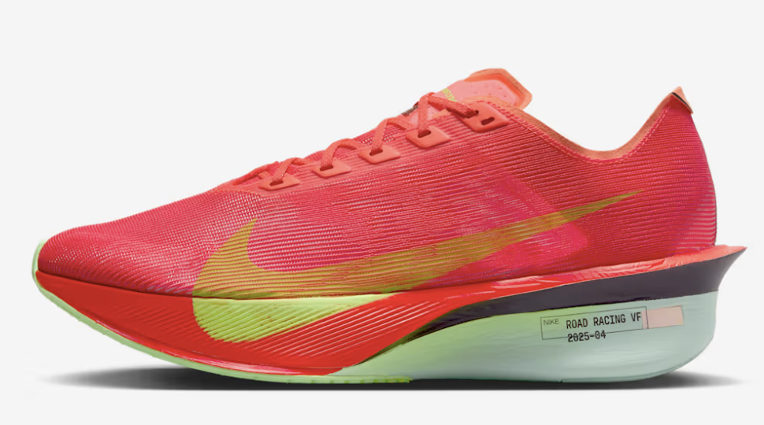
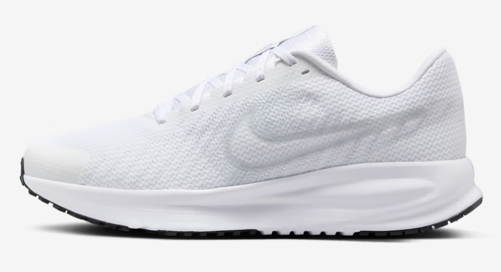
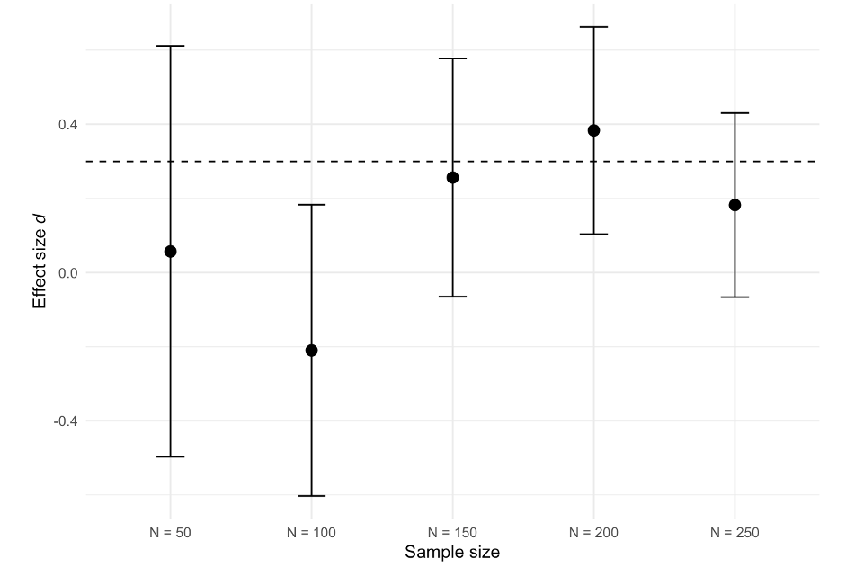
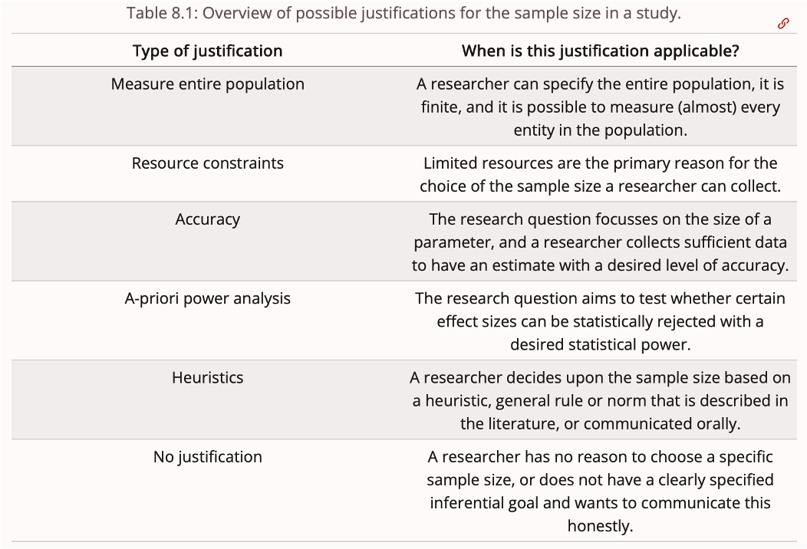
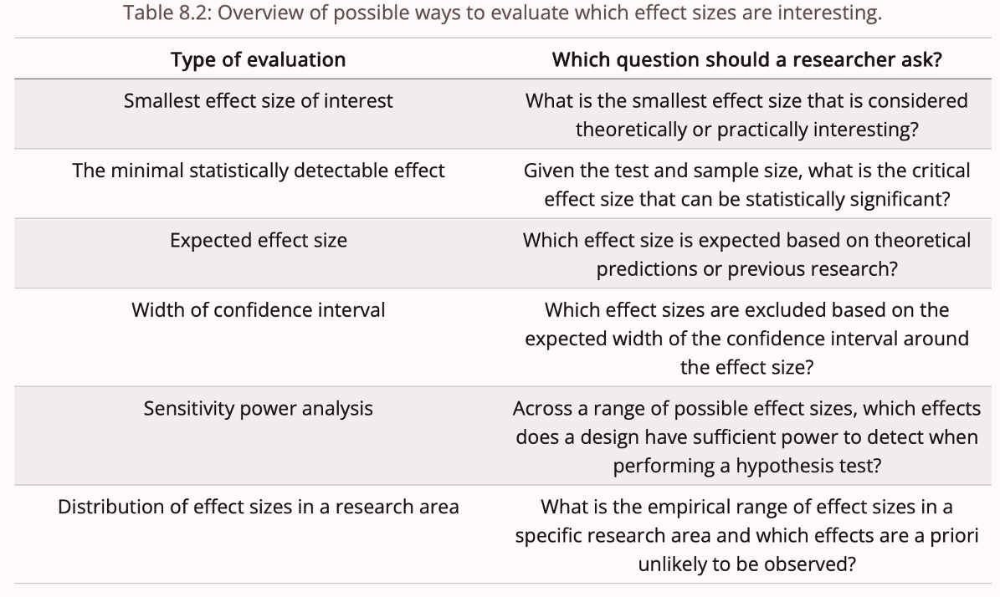
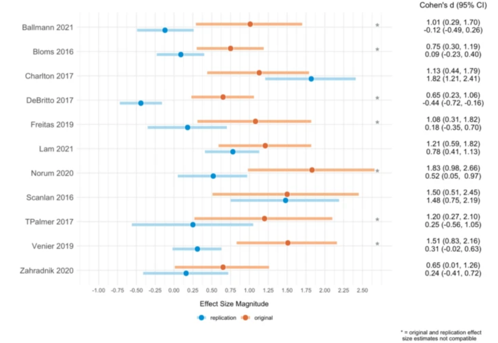
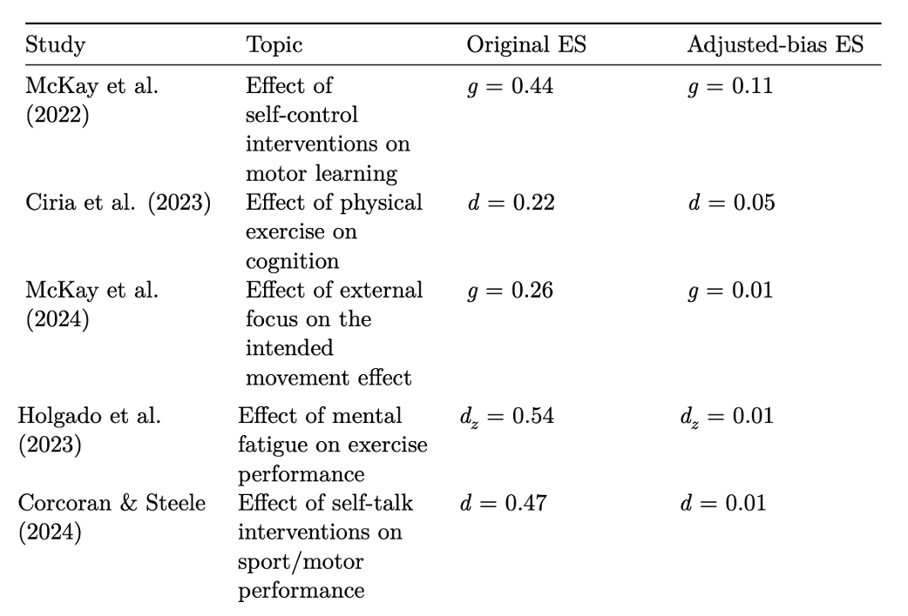
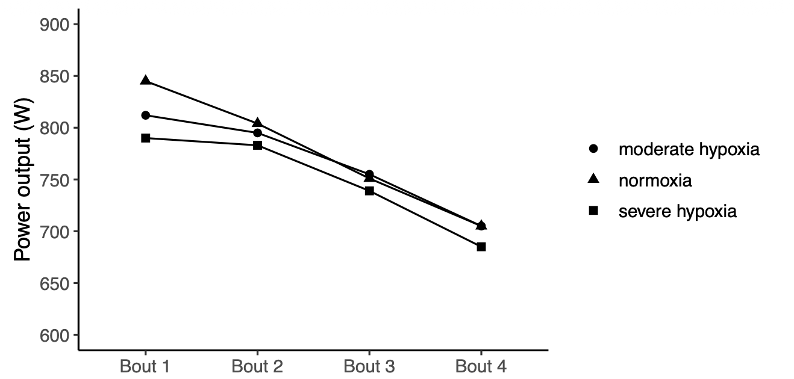
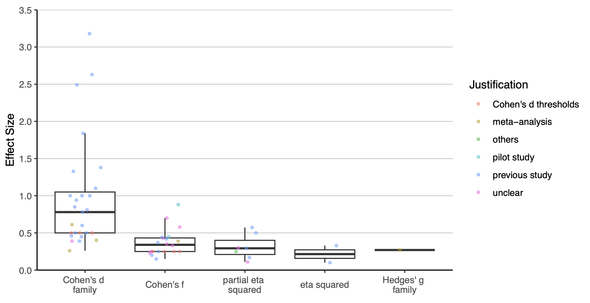
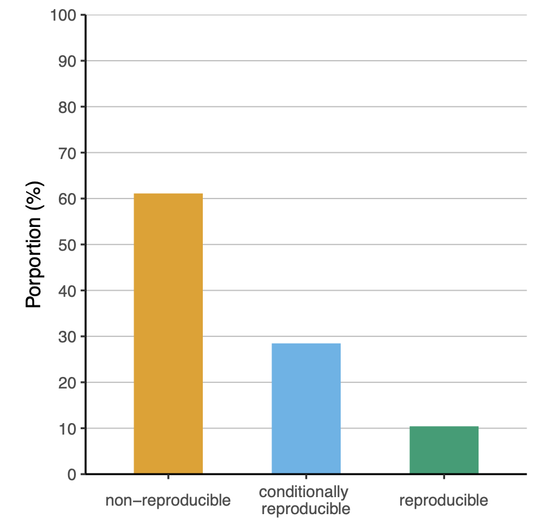

## What is your inferential goal?

-   To estimate the effect of an intervention (Δ)

-   To make claims while controlling the rate of incorrect conclusions

-   If your goals are those, then you are working within a **Frequentist** framework and should use **null hypothesis significance testing (NHST)**.

## Null Hypothesis Significance Testing

```{r fig.align ="center"}
knitr::include_graphics("figures/nhst.png")
```

## Sports scientists are usually interested in testing hypotheses

H: The new shoes show will increase running economy to a larger extent than the old shoes

```{r fig.align ="center", out.width="50%", fig.show="hold"}


```

## Two types of inferential errors

| Reality            | Difference detected     | No difference detected  |
|--------------------|-------------------------|-------------------------|
| No true difference | Type 1 error ($\alpha$) | true negative           |
| True difference    | true positive           | Type II error ($\beta$) |

## What is statistical power?

-   Power = 1 - $\beta$

-   The probability of finding a significant effect when $H_0$ is false

-   If we were going to repeat the same experiment 1000 times, how many times would we observe a significant effect?

## Frequentist interpretation of power

Distribution of *p*-values when power is \~80%

```{r}
#| echo: false
#| warning: false
#| message: false

library(ggplot2)

set.seed(123)

# Simulation parameters
n_sim <- 1000
n_per_group <- 400
effect_size <- 0.2

# Run simulations
p_values <- replicate(n_sim, {
  g1 <- rnorm(n_per_group, 0, 1)
  g2 <- rnorm(n_per_group, effect_size, 1)
  t.test(g1, g2, var.equal = TRUE)$p.value
})

df <- data.frame(p = p_values)

# Count significant p-values
n_sig <- sum(df$p < 0.05)

# Plot histogram
ggplot(df, aes(x = p)) +
  geom_histogram(bins = 50, fill = "grey70", color = "black") +
  geom_vline(xintercept = 0.05, color = "red", linewidth = 1) +
  annotate("text",
           x = 0.06,
           y = max(table(cut(df$p, breaks = 50))) * 0.9,
           label = paste0("p < 0.05: ", n_sig),
           hjust = 0,
           size = 5) +
  labs(x = "p-value", y = "Frequency") +
  theme_minimal(base_size = 16)
```

## Why design studies with high statistical power?

1 - Increased probability of rejecting $H_0$ when $H_0$ is true

2 - When a study design is underpowered to detect Δ, a non-significant $p$-value provides little information

-   Scenario A: A study designed with 90% to detect Δ yields a null finding ($p$ \< $\alpha$)

-   Scenario B: A study designed with 30% to detect Δ yields a null finding ($p$ \< $\alpha$)

-   What can we learn from study A and study B?

## Why design studies with high statistical power?

3 - Reduced uncertainty (narrower 95% CI)

```{r fig.align ="center", out.width="70%"}

```

## 

#### Studies designed with low power can be unethical

21. Medical research involving human participants must have a scientifically sound and rigorous design and execution that are likely to produce reliable, valid, and valuable knowledge and avoid research waste. [@helsinky_2025]

## 

Both insufficient and excessive sample sizes raise ethical concerns:

-   **Too few participants** → the study may be underpowered and unable to detect meaningful effects

-   **Too many participants** → unnecessary exposure to potential risks or burdens

Consider, for example:

-   evaluating a treatment to improve post-surgical recovery

-   conducting invasive procedures such as muscle biopsies

## Sample size justification 

```{r fig.align ="center", out.width="70%"}

```

[@lakens_sample_justification]

## A priori power analysis

$$
n = 2 * (\frac{Δ}{\sigma})^2 * (Z_{\alpha/2} + Z_{\beta})^2
$$

-   $n$: the number of participants

-   Δ: the difference sought (intervention effect)

-   $\sigma$: the presumed standard deviation

-   $\alpha$ : the probability of type I error, given $H_0$ is true

-   $\beta$: the probability of type II error, given $H_0$ is false

## Critical effect size

-   The critical effect size represent the smallest detectable effect that can reach statistical significance

-   Its value depends on the given sample size, $\alpha$, and test statistic.

-   It can be useful to calculate the critical effect size when designing a study and evaluate whether such effects are plausible

## Example

-   The typical sample size in sports and exercise science is \~30 participants

-   Suppose we are interested in comparing the effect of caffeine on CMJ height. What effect size could we expect?

```{r}
#| echo: true

crit_d <- criticalESvalue::critical_t2s(m1 = 60, m2 = 57, sd1 = 12, sd2 = 12, n1 = 15, n2 = 15, var.equal = FALSE,hypothesis = "greater", conf.level = 0.95)

kableExtra::kable(dplyr::bind_rows(
  type_effect_size = c("d", "g"), 
  effect_size = c(crit_d$d, crit_d$g),
  critical_effect_size = c(crit_d$dc, crit_d$gc))
  )
```

## The biggest challenge

-   The true Δ is unknown, so researchers need to make an assumption about the true size of Δ

## Effect size (Δ) justification

```{r fig.align ="center", out.width="70%"}

```

## Expected Δ

-   Because Δ is unknown, researchers need to assume it

-   Sports scientists often rely on single studies, meta-analysis or pilot studies

-   However, each of these approaches comes with its own limitations

## Estimated Δ vs. population Δ

-   We collect a **sample** from a larger population
-   Effect sizes from a study are **estimates** of the true population effect
-   Estimates vary due to sampling error
-   Smaller samples → more sampling error
-   More sampling error → less precise effect size estimates

## 

### Population Δ = 0.5

```{r}
set.seed(123)

library(ggplot2)
library(effectsize)

sim <- function(n){
  group1 <- rnorm(n, 0.5, 1)
  group2 <- rnorm(n, 0, 1)
  d <- cohens_d(group1, group2)$Cohens_d
}

d_rep <- replicate(100, sim(30))

d_rep |> 
  as.data.frame() |>  
  dplyr::rename(d = 1) |> 
  ggplot(aes(x = d, y = "Cohen's d")) +
  ylab(NULL) +
  geom_vline(xintercept = 0.5) +
  geom_jitter() +
  ggtitle("Distribution of effect sizes generated using a two independent-group design with N = 30 and a true effect of 0.5")
```

## 

### Safeguard power analysis

-   By chance, it is possible that the estimated Δ is biased.

-   @perugini2014 suggest to take into account the uncertainty of the sample effect size by using the lower bound of a 60% CI

```{r}
#| echo: true

MBESS::ci.smd(smd = 0.5, n.1 = 20, n.2 = 20, conf.level = 0.60)
```

## 

### Conduct a safeguard power analysis

```{r}
#| echo: true

d <- 0.5
n <- 15

(d_safeguard = MBESS::ci.smd(smd = d, n.1 = n, n.2 = n, conf.level = 0.60))
```

## 

### Inflated estimates of the true Δ

-   The combination of underpowered study designs and selection bias (including publication bias and questionable research practices) often leads to inflated effect sizes.

-   For example, @murphy2025 reported a median decrease of 75% in replicated effect sizes compared to the original findings.

## 

### Results of the Sport Science Replication Project

```{r fig.align ="center", out.width="70%"}

```

## 

### Inflated ES in meta-analyses

```{r fig.align ="center", out.width="70%"}

```

## 

### Studies (and studies included in meta-analysis) often different in critical aspects

PICOS:

-   Population

-   Intervention

-   Comparator

-   Outcome

-   Study design/statistical test

## 

### Population

-   Elite athletes, highly-trained athletes, sedentary participants, patients, students, etc.

-   Intervention effects may vary across populations.

-   For example, a training intervention is likely to produce greater performance improvements in untrained or less trained individuals compared to highly trained athletes.

## 

### Intervention

-   Dose, intensity, duration, type of intervention, frequency, etc.

-   All these variables can impact the intervention effect.

```{r}
library(dplyr)
library(ggplot2)

set.seed(123)

# Time points (months)
time <- 0:12

# Number of participants per group
n <- 30

# Function to generate diminishing returns
growth_curve <- function(t, max_gain, rate) {
  max_gain * (1 - exp(-rate * t))
}

# Simulate data
data <- expand.grid(
  subject = 1:n,
  group = c("1x_week", "2x_week"),
  month = time
)

# Add baseline values
data$baseline <- rnorm(n * 2, mean = 40, sd = 10)

# Assign group-specific parameters
data$gain <- ifelse(
  data$group == "1x_week",
  growth_curve(data$month, max_gain = 20, rate = 0.4),
  growth_curve(data$month, max_gain = 35, rate = 0.4)
)

# Add individual variation + noise
data$strength <- data$baseline +
  data$gain +
  rnorm(nrow(data), 0, 3)

# Summarise to group means
summary_data <- data |> 
  group_by(group, month) |> 
  summarise(mean_strength = mean(strength), .groups = "drop")

# Plot
ggplot(summary_data, aes(month, mean_strength, colour = group)) +
  geom_line() +
  ylab("1-RM")
```

## 

### Comparator

-   Placebo, active comparator (standard procedure), no-treatment control, dose-response comparator, historic comparator.
-   For example, comparing a new intervention against placebo might result in a smaller effect compared with a no-treatment control.

## 

### Outcome

-   What outcome was used to measure the impact of the intervention?

-   $VO_{2MAX}$, velocity at lactate threshold 2, countermovement jump (CMJ) height, 10-m sprint velocity, etc.

-   The same intervention may yield different results depending on the measured outcome.

-   For example, plyometric training is likely to improve CMJ height to a larger extant than 10-m sprint velocity.

## 

### Study design

-   Pre-post design, parallel control group design, randomized controlled trial (RCT)
-   Different study designs are associated with varying risks of bias; for example, pre–post designs generally have a higher risk of bias compared to randomized controlled trials (RCTs)
-   Within-subject effect size usually are larger than between-subject effect size because the correlation between measurements reduces variance.

## 

### Heterogeneity in meta-analyses

-   Studies included in meta-analyses may vary across these 5 dimensions

-   This may result in effect-size heterogeneity

-   If heterogeneity is present, researchers should focus on subgroup of studies that are more comparable

## 

### Take home message

-   These 5 dimensions need to be taken into account when selecting an effect size from a previous study/meta-analysis

-   Ignoring these dimensions may result in selecting a Δ that does not match our Δ of interest

## 

### Pilot studies

-   Pilot studies can provide useful data for some parameters (e.g., variability, feasibility) [@yingDeterminingSampleSize2025]

-   Pilot trials are not suitable for determining Δ for two main reasons [@yingDeterminingSampleSize2025; @lakens_followup_bias]:

-   1 - pilot trials have small sample sizes that result in imprecise estimates of Δ (wide 95% CI)

-   2- Pilot trials with promising results might be more likely to be published resulting in inflated Δ estimates

## 

```{r}
#| echo: false
#| warning: false
#| message: false

library(ggplot2)
library(effectsize)
library(dplyr)
library(patchwork)

set.seed(123)

# Function to simulate pilot studies
simulate_pilot <- function(n_studies, n_per_group, true_effect) {
  results <- data.frame(
    study = 1:n_studies,
    d = numeric(n_studies),
    lower = numeric(n_studies),
    upper = numeric(n_studies)
  )
  
  for (i in seq_len(n_studies)) {
    g1 <- rnorm(n_per_group, mean = 0, sd = 1)
    g2 <- rnorm(n_per_group, mean = true_effect, sd = 1)
    
    d_out <- cohens_d(g2, g1, pooled_sd = TRUE, ci = 0.95)
    
    results$d[i]     <- d_out$Cohens_d
    results$lower[i] <- d_out$CI_low
    results$upper[i] <- d_out$CI_high
  }
  return(results)
}

true_effect <- 0.5

# Simulate 5 small studies (n=10)
small_studies <- simulate_pilot(n_studies = 5, n_per_group = 10, true_effect = true_effect)

# Simulate 5 large studies (n=200)
large_studies <- simulate_pilot(n_studies = 5, n_per_group = 200, true_effect = true_effect)

# Plotting function
plot_pilot <- function(df, n_per_group) {
  ggplot(df, aes(x = factor(study), y = d)) +
    geom_point(size = 3, color = "blue") +
    geom_errorbar(aes(ymin = lower, ymax = upper), width = 0.2, color = "blue") +
    geom_hline(yintercept = true_effect, color = "red", linetype = "dashed") +
    labs(
      title = paste("Pilot Studies (n per group =", n_per_group, ")"),
      x = "Study",
      y = "Estimated Cohen's d"
    ) +
    theme_classic(base_size = 14)
}

# Create plots
p1 <- plot_pilot(small_studies, 10)
p2 <- plot_pilot(large_studies, 200)

# Arrange side by side
p1 + p2
```

## Distribution of effect sizes

-   Often sports scientists use Cohen's *d* thresholds to justify their effect size

-   This is problematic because it ignores the study context [@primbs2022]

-   Cohen’s d thresholds were obtained from studies published in social psychology studies in the 80s [@cohen1988]

-   Can we expect that a study published in social psychology has similar contextual factors (PICOS dimensions)? Definitely NOT

## Distribution of effect sizes in a research area

-   Less problematic than Cohen's *d* thresholds, but the study context not fully taken into account

-   Distribution of effect sizes in Strength and Conditioning resesearch [@swinton; @swinton2022]

-   Distribution of effect sizes in exercise treatment of tendinopathy [@swinton2023]

## Smallest Effect size of Interest (SESOI)

-   The difference you would not like to miss

-   The smallest effect size that is considered practically or theoretically interesting [@lakens_sample_justification]

-   Not affected by selection bias

-   Difficult to determine

## Additional things to consider when performing an a priori power analysis

## 

### Directional vs. non-directional test

```{r}
#| echo: true
d <- 0.2
p <- 0.9
alpha <- 0.05
type <- "two.sample"

# directional test
directional <- pwr::pwr.t.test(d = d, power = p, sig.level = alpha, type = type, alternative = "greater")

# Non-directional (two-sided) test
non_directional <- pwr::pwr.t.test(d = d, power = p, sig.level = alpha, type = type, alternative = "two.sided")

# Combine results
data.frame(test = c("directional", "non-directional"), sample_size = c(ceiling(directional$n), ceiling(non_directional$n)))
```

## 

### Include covariates in the statistical model

```{r}
#| message: false

set.seed(123)

n_per_group <- 100
n <- n_per_group * 2

# Generate Data
pretest <- rnorm(n, mean = 50, sd = 10)
group <- factor(rep(c("Control", "Treat"), each = n_per_group))

# Post-test depends on pre-test (correlation) and group effect
# Post = baseline + effect + noise
posttest <- 5 + (0.8 * pretest) + ifelse(group == "Treat", 10, 0) + rnorm(n, 0, 5)
```

```{r}
# Create dataframe
df <- data.frame(id = 1:n, group, pretest, posttest)

# ANCOVA model
ancova <- lm(posttest ~ group + pretest, data = df) |> 
  broom::tidy() |> 
  filter(term == "groupTreat")

# ANOVA model
anova <- lm(posttest ~ group, data = df) |> 
  broom::tidy() |> 
  filter(term == "groupTreat")

# Combine results
bind_rows(ancova, anova) |> 
  dplyr::select(term, estimate, std.error) |> 
  kableExtra::kable()
```

## 

The larger $\rho$ the smaller the SE and the higher the power of the test

```{r fig.align ="center", out.width="60%"}
knitr::include_graphics("figures/ancova.png")
```

Original figure obtained from [Solom Kurz's blogpost](https://solomonkurz.netlify.app/blog/2023-04-12-boost-your-power-with-baseline-covariates/)

## 

### Account for multiple comparisons

-   Disjunction vs. conjunction hypothesis

-   Disjunction requires adjusting for multiple comparisons

-   Claim there is an effect after observing any $p$ \< $\alpha$

## 

### Example of disjunction hypothesis

-   H: Orange shoes improve running economy and reduce DOMS

-   Researcher measures 2 outcomes and conducts 2 tests at an $\alpha$ level of 0.05

-   In a disjunction hypothesis, the researcher is willing to support H if any test yields a significant outcome

-   Researcher needs to adjust for multiple comparisons (e.g., Bonferroni correction; 0.05/number of tests)

## Multiplicity of tests

-   Sports scientists often perform multiple hypothesis tests

-   Each one of these tests will achieve a certain level of statistical power

-   Option A): Design a study with adequate power for the smallest effect size

-   Option B) Differentiate between primary, secondary and exploratory tests

-   Perform a sensitivity power analysis for secondary tests [@lakens_sample_justification]

## 

### Sensitivity power analysis

-   A sensitivity power analysis indicates the range of effect sizes that a given study design is sufficiently powered to detect.

-   Informative when the sample size is fixed (or data has already been collected) and secondary analysis

```{r}
effect_size <- seq(0.1, 1, 0.05)

power <- purrr:::map_dbl(effect_size,  ~pwr:::pwr.t.test(d = .x, n = 40, sig.level = 0.05, type = "two.sample")$power)

df <- data.frame(effect_size, power)

df |> ggplot2:::ggplot(aes(y = effect_size, x = power)) +
  geom_point() +
  geom_line() +
  scale_y_continuous(breaks = seq(0, 1, by = 0.1)) +
  scale_x_continuous(breaks = seq(0, 1, by = 0.1)) +
  ylab("Effect size (d)")
```

## 

## Current state of affairs

-   Typical sample size in the field is about 35 participants.

-   About 40% of studies ($N$ = 350) reported an a priori power analysis.

-   Average statistical power of 11% ($N$ = 350) [@mesquida].

-   Reporting an a priori power analysis was not associated with larger sample sizes or a higher proportion of supported hypotheses.

## Why reporting an a priori power analysis does not lead to larger sample sizes despite the low power?

Some reasons are:

-   Many a priori power analyses are conducted in a way that yields the sample size researchers aim to recruit — also known as "sample size samba" — [@schulz2005]

-   Inflated effect sizes

-   Using an effect size estimate that does not match the intervention effect (difference across the PICOS dimensions)

-   Using a statistical test that does not match statistical test used to evaluate the hypothesis

## Example of invalid power analysis

**Study aim**: to determine whether acute moderate hypoxia, compared to normoxia, had no detrimental effect on power output during 3 x 30-s all-out efforts.

**Sample size justification**: "The sample size was estimated using a power analysis software G\*Power (version 3.1.9.2; Bonn University, Bonn, Germany) based on the mean effect (d = 3.18) of the within-condition decrement to peak and mean power output during repeated 30-s Wingate efforts.10 The power analysis resulted in a calculated total sample size of 4 participants."

## 

```{r fig.align ="center", out.width="60%"}

```

## Distribution of effect sizes in power analysis

```{r fig.align ="center", out.width="60%"}

```

## Transparency of power analysis

-   Power analyses often lack sufficient detail to allow evaluation and reproduction

<!-- -->

-   Key information, such as the statistical test used and the assumed effect size, is frequently missing

-   All information used to conduct the power analysis should be reported

-   The justification of the effect size and how it was calculated should be reported

## 

### Reproducibility of a priori power analyses in 350 studies

```{r fig.align ="center", out.width="90%"}

```

[@mesquida2025]

## Take-home message

-   What are you powering for?

-   Apply PICOS framework when selecting a study based on previous research

-   Account for biased effect sizes when selecting a study based on previous research

-   Collaborate with an applied statistician

-   Report all information required to evaluate its soundness and reproducibility

## References
