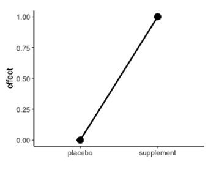
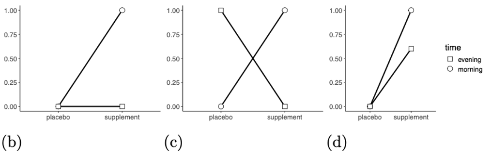
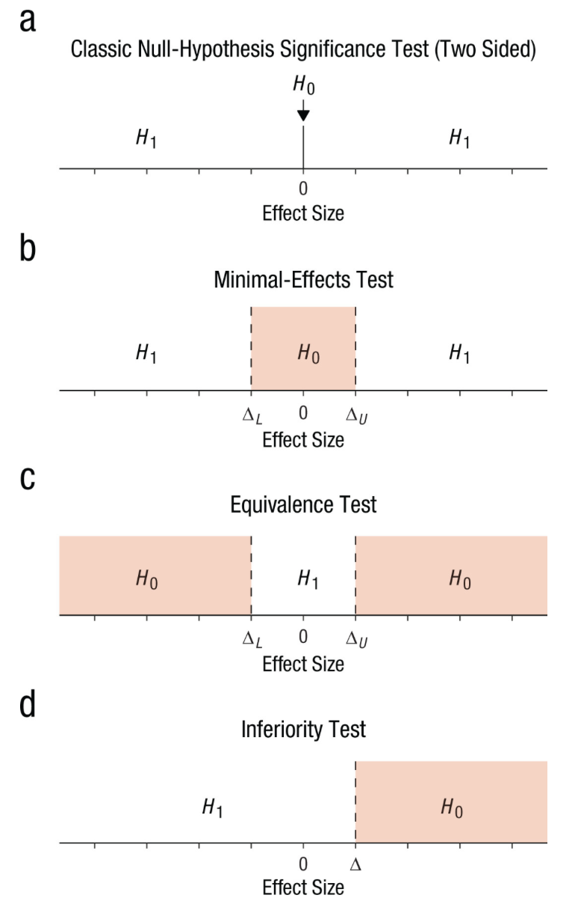

Load packages:

```{r}
#| message: false

library(MBESS)      # account for uncertainity in effect sizes
library(dplyr)      # tidy data
library(purrr)      # itinerations
library(effectsize) # calculate effect sizes
library(broom)      # tidy statistical objects
library(faux)       # simulate data for factorial designs
library(pwr)        # power analysis for basic designs (eg., t-test)
library(Superpower) # power analysis for factorial design
library(TOSTER)     # equivalence tests
library(pwr2ppl)    # power analysis for basic designs and logistic regression
library(emmeans)    # marginal means and post hoc comparisons
```

### Account for uncertainty and bias when using an published effect size estimate

Suppose we are interested in answering the following research question (RQ):

-   *Does the consumption of creatine improve power output during a cycling time trial compared to a placebo?*

We rely on a published study and assume that the true effect size is similar to the one reported. However, publication bias may inflate reported effects, and many studies are, on average, underpowered.

As a result, there is **uncertainty about the true effect size**, which should be explicitly accounted for when planning the study.

To address this, we can use the `MBESS` package to incorporate **uncertainty in effect size estimates** into the power analysis, leading to more robust sample size justification.

```{r}
#| echo: true

res <- ci.smd(
  smd = 0.5, 
  n.1 = 20, 
  n.2 = 20, 
  conf.level = 0.60
  )
```

Conduct a power analysis using the lower bound of the 60% CI:

```{r}
pwr.t.test(
  d = res$Lower.Conf.Limit.smd,
  power = 0.9,
  sig.level = 0.05,
  alternative = "greater"
  )
```

### ANOVA

In sports and exercise science, **factorial designs** are common. These designs can be implemented as **between-subjects** (each participant is assigned to one condition), **within-subjects** (each participant experiences all conditions), or **mixed designs** (one factor is between-subjects and the other within-subjects). This structure enables researchers to examine both the **main effects** of each factor and their **interaction effect**.

#### Superpower

`Superpower` [@caldwell2022] is an *R* package (also available as [Shiny app](https://shiny.ieis.tue.nl/anova_power/)) to conduct power analyses. One of the main benefits of `Superpower` is that it does not require a standardized effect size, in contrast to tools such as G\*Power or `pwr`.

##### Between-subject ANOVA

Suppose we are interested in testing these three RQs:

-   *Does consuming chocolate affect power output during a time trial compared to water?*

-   *Does consuming dates affect power output during a time trial compared to water?*

-   *Does consuming raisins affect power output during a time trial compared to water?*

::: callout-note
Note these are three different RQs (hypotheses) so we do not need to adjust for multiple comparisons
:::

We first begin by setting the parameters to simulate data based on our study design using `ANOVA_design()`:

```{r}
design_result <- ANOVA_design(
  design = "4b",
  n = 80,
  mu = c(120, 125, 130, 135),
  sd = 20,  # common standard deviation
  labelnames = c("Supplement",
                 "water", "chocolate", "dates", "raisins"),
  plot = TRUE
  )
```

We then use `ANOVA_exact` to conduct the computation:

```{r}
res <- ANOVA_exact(
  design_result,
  alpha_level = 0.05,
  emm = TRUE
  )
```

```{r}
res$aov_result 
```

Power for the effect of Supplement:

```{r}
res$main_results
```

Power for each of the post hoc comparisons:

```{r}
res$pc_results
```

Because we are not interested in all possible comparisons, we can use specific contrasts with the `emmeans` package. Since our focus is on comparing each supplement to water, we can set water as the reference group and perform targeted comparisons accordingly.

```{r}
(comparisons <- emmeans(
  res$emmeans$emmeans,
  specs = trt.vs.ctrl ~ Supplement, 
  ref = 4,
))
```

Power for the comparisons of interest:

```{r}
emmeans_power(comparisons$contrasts)
```

Now suppose we are interested the following RQ:

-   *Does the consumption of chocolate milk affect power output during a time trial compared to placebo?*

-   *Does the consumption of chocolate milk affect power output during a time trial compared to dates?*

```{r}
#| output: false

design_study <- ANOVA_design(
  design = "3b",
  n = 20,
  mu = c(120, 135, 130),
  sd = 20,  # common standard deviation
  labelnames = c("Supplement",
                 "placebo", "chocolatemilk", "dates"),
  plot = TRUE
)
```

```{r}
res <- ANOVA_exact(
  design_study,
  alpha_level = 0.05,
  emm = TRUE
  )
```

```{r}
comparisons <- emmeans(
  res$emmeans$emmeans,
  specs = ~ Supplement
  )
```

```{r}
contrast <- contrast(
  comparisons,
  list(rq1 = c(1, 0, -1), # chocolatemilk vs. placebo
       rq2 = c(1, -1, 0)) # chocolatemilk vs. dates
  )
```

Power of each of the two contrasts:

```{r}
emmeans_power(contrast)
```

Now suppose that we are interested in the following RQ:

-   *Does the consumption of any dose of caffeine affects power output during a time trial in comparison to a placebo?*

```{r}
design_study <- ANOVA_design(
  design = "3b",
  n = 40,
  mu = c(120, 125, 130),
  sd = 20,  # common standard deviation
  labelnames = c("Supplement",
                 "placebo", "dose1", "dose2"),
  plot = TRUE
)
```

```{r}
#| output: false

res <- ANOVA_exact(
  design_study,
  alpha_level = 0.05,
  emm = TRUE
)
```

```{r}
comparisons <- emmeans(
  res$emmeans$emmeans,
  specs = ~ Supplement
  )
```

```{r}
custom_contrast <- contrast(
  comparisons,
  list(c1 = c(1, 0, -1), # dose1 vs. placebo
       c2 = c(0, 1, -1)) # dose2 vs. placebo
)
```

Power for each of the two contrasts:

```{r}
emmeans_power(
  custom_contrast,
  alpha_level = 0.05/2
  )
```

We adjust $\alpha$ (i.e., $\alpha$ divided by the number of comparisons) because we are testing a **disjunction hypothesis**, meaning we will consider the hypothesis supported if any dose significantly affects power output compared to the placebo.

##### Within-subject ANOVA

Suppose we are interested in testing the following research question:

-   *Does increasing doses of caffeine produce a dose–response effect on power output during a time trial, compared with water (placebo)?*

```{r}
design_result <- ANOVA_design(
  design = "4w",
  n = 30,
  mu = c(120, 125, 130, 135),
  sd = 20,  # common standard deviation
  r = 0.7,  # common correlation
  labelnames = c("Supplement",
                 "water", "small", "medium", "high"),
  plot = TRUE)
```

```{r}
#| output: false
res <- ANOVA_exact(
  design_result,
  alpha_level = 0.05,
  emm = TRUE
  )
```

```{r}
comparisons <- emmeans(
  res$emmeans$emmeans,
  specs = ~ Supplement
  )
```

We need to assign a set of contrasts to each condition based on the expected pattern of means. The contrast `linear_trend = c(-2, -1, 1, 2)` assigns weights to ordered groups to test for a linear increase or decrease across them; the coefficients sum to zero and give progressively larger positive weights to higher levels and negative weights to lower levels.

```{r}
custom_contrast <- contrast(
  comparisons,
  list(linear_trend = c(-2, -1, 1, 2))
)
```

Power of the contrast test:

```{r}
emmeans_power(custom_contrast)
```

##### 2x2 within-subject ANOVA

```{r}
design_result <- ANOVA_design(
  design = "2w*2w",
  n = 80,
  mu = c(120, 125, 120, 130),
  sd = 20,  # common standard deviation
  r = 0.8, # common correlation
  labelnames = c("Supplement",
                 "water", "coffee",
                 "WARMUP",
                 "long", "short"),
  plot = TRUE)
```

###### ANOVA_exact

Using `Superpower:::ANOVA_exact` to conduct a power analysis performs only a single computation based on the specified parameters, meaning it yields an exact analytic solution for power.

```{r}
#| output: false

res <- ANOVA_exact(
  design_result,
  alpha_level = 0.05
  )
```

Power for main effects and interaction effect:

```{r}
res$main_results
```

Power for pairwise comparisons:

```{r}
res$pc_results
```

###### ANOVA_power

Using `Superpower:::ANOVA_power` to conduct a power analysis relies on Monte Carlo simulations, meaning it repeatedly generates many random datasets based on the specified design parameters and estimates statistical power as the proportion of simulations in which the effect is detected (i.e., $p$ \< $\alpha$).

```{r}
#| output: false

res_sim <- ANOVA_power(
  design_result,
  alpha_level = 0.05,
  nsims = 1000
  )
```

Power for main effects and interaction effect:

```{r}
res_sim$main_results
```

Power for pairwise comparisons:

```{r}
res_sim$pc_results
```

##### 2x2 mixed ANOVA

Now suppose we are interested in the following RQ:

-   *Does a 4-week HIIT training (2 sessions per week) lead to changes in* $VO_{2max}$ *at 6 weeks post-intervention?*

```{r}
design_result <- ANOVA_design(
  design = "2b*2w",
  n = 80,
  mu = c(65, 75, 65, 72),
  sd = c(10, 10, 20, 20),  # assing different SDs
  r = 0.8,                # common correlation
  labelnames = c("Intervention",
                 "HIIT", "Standard",
                 "Time",
                 "pre", "post"),
  plot = TRUE)
```

```{r}
#| echo: false
res <- ANOVA_exact(
  design_result,
  alpha_level = 0.05
  )
```

Power for main effects and interaction effects:

```{r}
res$main_results
```

Power for the comparison between interventions at week 6:

```{r}
res$pc_results[5,]
```

### 

Now suppose we are interested in answering the following RQ:

-   *Does a 4-week HIIT training (2 sessions per week) lead to changes in* $VO_{2max}$ *at 6 and 8 weeks post-intervention?*

```{r}
design_result <- ANOVA_design(
  design = "2b*3w",
  n = 80,
  mu = c(75, 82, 82, 75, 79, 77),
  sd = 10,  
  r = 0.8,                # common correlation
  labelnames = c("Intervention",
                 "HIIT", "Standard",
                 "Time",
                 "pre", "post6", "post8"),
  plot = TRUE)
```

```{r}
#| echo: false

res <- ANOVA_exact(
  design_result,
  alpha_level = 0.05,
  emm = TRUE
  )
```

```{r}
emm_results <- res$emmeans$emmeans
```

Compare HIIT vs Standard at each time point (post6, post8, etc.):

```{r}
pairwise_results <- emmeans(
  emm_results,
  pairwise ~ Intervention | Time
)
```

Power of each comparison:

```{r}
emmeans_power(pairwise_results$contrasts)
```

### Linear model regression with one single dichotomous predictor

The general equation for a linear model is:

$$
y = b_0 + b_1*x_1 + b_2*x_2 + ... + \epsilon
$$

We can use this model to simulate data.

Suppose an article investigated the effect of endurance training on $VO_{2max}$ using a two independent-groups study design.

```{r}
set.seed(123)

n <- 60 # sample size

# Simulate data
df <- data.frame(
  exp = c(rep(0, n/2), rep(1, n/2)),
  outcome = c(rnorm(n/2, 58, 8), 
              rnorm(n/2, 60, 8))
  )

# Fit the model
(model <- lm(outcome ~ exp, df) |> tidy())
```

In a RCT, the intervention effect corresponds to the estimate of the slope. The standardized effect size estimate ca be expressed as Cohen’s *d*, which is the mean difference divided by the standard deviation (SD):

```{r}
(es <- model$estimate[2]/sd(df$outcome))
```

This effect size estimate can be used to conduct an a priori power analysis:

```{r}
pwr.t.test(
  power = 0.9, 
  d = es, 
  sig.level = 0.05, 
  type = "two.sample", 
  alternative = "two.sided"
  )
```

We could use the same model and estimate of the intervention effect to conduct a simulation-based power analysis:

```{r}
set.seed(123)

n <- 160 # total sample size
exp <- c(rep(0, n/2), rep(1, n/2)) # assign participants to 0 or 1
sd <- sd(df$outcome) # calculate SD

# Write down the equation
outcome <- 55 + 4*exp + rnorm(n, mean=0, sd=sd)

# combine all variables in one data frame
df <- data.frame(exp, outcome)

head(df)
```

Fit the ANOVA model:

```{r}
lm(outcome ~ exp, df) |> 
  tidy()
```

Due to sampling variability, the estimate of the intervention effect will vary from sample to sample. We can perform a simulation-based power analysis to account for this uncertainty (Monte Carlo simulation).

```{r}

# Create a simulation function
sim1 <- function(effect, n){
  
  exp <- c(rep(0, n/2), rep(1, n/2))
  
  #Simulate the data 
  outcome <- 55 - effect*exp + rnorm(n, mean=0, sd=sd)
  
  # Fit ANOVA model
  res <- tidy(lm(outcome ~ exp))
  
  # Extract the p-value
  p_value <- res$p.value[2]
}

# Run the simulation function
p_values <- replicate(1000, sim1(effect = 5, n = 100))

# Count how many p-values are smaller than the alpha level
mean(p_values < 0.05)
```

In a Monte Carlo simulation, the power of the test is nothing else than the number of *p*-values that fall below the alpha level.

### Linear model regression with one single dichotomous predictor and a baseline covariate

In the morning we saw that including a baseline covariate can boost power. To simulate data for a factorial design, we can use the `faux` package which allows to easily simulate correlated data.

```{r}
set.seed(123)

n <- 80
sd <- 7.19
r <- 0.6

# One between-subject factor with two levels
between <- list(condition = c(con = "control", exp = "experiment"))

# One within-subject factor with two levels
within <- list(time = c("pre", "post"))

# Set means
mu <- data.frame(
  con    = c(57, 58),
  exp    = c(57, 62),
  row.names = within$time
)

# Simulate data
df2 <- sim_design(
  within, 
  between, 
  n = n, 
  mu = mu, 
  sd = sd, 
  r = r
  )
```

```{r}
# Fit ANCOVA model
(model <- lm(post ~ condition + pre, df2) |> 
  tidy())
```

```{r}
sim2 <- function(n, r){

# One between-subject factor with two levels
between <- list(condition = c(con = "control", exp = "experiment"))

# One within-subject factor with two levels
within <- list(time = c("pre", "post"))

# Set means
mu <- data.frame(
  con = c(57, 58),
  exp = c(58, 62),
  row.names = within$time
)

# Simulate data
df2 <- sim_design(
  within, 
  between, 
  n = n, 
  mu = mu, 
  sd = 8, 
  r = r,
  plot = FALSE
  )

# Fit ANCOVA model
model <- lm(post ~ condition + pre, df2) |> 
  tidy()

# Extract p-value for 'condition'
p_value <- model$p.value[2]
}

# Run the simulation function
p_values <- replicate(1000, sim2(n = 80, r = 0.6))

# Count how many p-values are smaller than the alpha level
mean(p_values < 0.05)
```

Now let's rerun the simulation but without including the baseline covariate and let's compare the statistical power of the design against with the power achieved by the ANCOVA model.

```{r}
sim3 <- function(n, r){

# One between-subject factor with two levels
between <- list(condition = c(con = "control", exp = "experiment"))

# One within-subject factor with two levels
within <- list(time = c("pre", "post"))

# Set means
mu <- data.frame(
  con = c(57, 58),
  exp = c(58, 62),
  row.names = within$time
)

# Simulate data
df2 <- sim_design(
  within, 
  between, 
  n = n, 
  mu = mu, 
  sd = 8, 
  r = r,
  plot = FALSE
  )

# Fit ANCOVA model
model <- lm(post ~ condition, df2) |> 
  tidy()

# Extract p-value for 'condition'
p_value <- model$p.value[2]
}

# Run the simulation function
p_values <- replicate(1000, sim3(n = 80, r = 0.6))

# Count how many p-values are smaller than the alpha level
mean(p_values < 0.05)
```

Instead of relying on trial and error to determine the sample size, we can use `map_dbl()` to run simulations across a range of sample sizes and efficiently estimate the corresponding power for each.

```{r}
# sequence of sample sizes
n <- seq(30, 120, 10)

# Compute estimated power for each n
power_estimates <- map_dbl(n, function(nsize) {
  p_values <- replicate(1000, sim2(n = nsize, r = 0.6))
  mean(p_values < 0.05)
})

# Combine results into a data frame
power_df <- data.frame(
  n = n,
  power = power_estimates
)

power_df
```

#### Difference in difference approach to estimate interaction effects

One simple approach to estimate an effect size for an interaction effect is based on the difference-in-difference approach [@sommet_interaction]; @langenberg_tutorial\].

```{r fig-simple, fig.align ="center", out.width="70%"}

```

In @fig-simple, we would use @eq-d to estimate a standardised effect size (Cohen's $d_s$) for a two-group design.

$$
d_{s} = \frac{(E - C)}{SD_{pooled}} 
$$ {#eq-d}

Using @eq-d, we would obtain a Cohen's $d_s$ of:

```{r}
m1 <- 1  # intervention group mean
m2 <- 0  # control group mean
sd <- 2  # pooled standard deviation

(d <- (m1 - m2)/sd)
```

A common issue in sports science is the uncritical adoption of effect sizes from previous studies based on simpler designs, which may not align with the factorial structure of the current study when conducting a power analysis for an interaction effect. Whether Cohen’s $d_s$ is an appropriate estimate of the interaction effect depends on the underlying pattern of means, that is, the type of interaction.

```{r fig-interaction, fig.cap="b) Fully attenuated interaction, c) crossover interaction, d) attenuated interaction"}

```

Using @eq-dint, we can estimate the interaction effect based on the pattern of means observed in a 2 × 2 between-subjects design. This effect size is calculated as a “difference in differences” as follows [@sommet_interaction]:

$$
d_{int} = \frac{(E_2 - C_2) - (E_1 - C_1)}{(2*SD_{pooled})} 
$$ {#eq-dint}

For @fig-interaction b, the interaction effect (fully attenuated interaction) would be:

```{r}
E1 <- 0
C1 <- 0
E2 <- 1
C2 <- 0
sd <- 2
((E2 - C2) - (E1 - C1)) / (2*sd)
```

For @fig-interaction c, the interaction effect (crossover interaction) would be:

```{r}
E1 <- 0
C1 <- 1
E2 <- 1
C2 <- 0
sd <- 2
((E2 - C2) - (E1 - C1)) / (2*sd)
```

For @fig-interaction d, the interaction effect (attenuated interaction) would be:

```{r}
E1 <- 0.6
C1 <- 0
E2 <- 1
C2 <- 0
sd <- 2
((E2 - C2) - (E1 - C1)) / (2*sd)
```

Once the interaction effect size has been estimated, we can plug in the estimated Cohen's $d_{int}$ into the statistical software. For example:

```{r}
sample <- pwr.t.test(d = 0.1, power = 0.9, sig.level = 0.05, type = "two.sample", alternative = "two.sided")
sample$n 
```

We can also use the same in differnce-in-difference approach for factorial within-subject designs [@langenberg_tutorial]. The only difference is that we need to specify the

### Equivalence tests

Sports scientists typically aim to reject the null hypothesis of zero (i.e., $H_0$ =0) to conclude that two interventions differ, or that one is superior or inferior to a standard intervention. However, in some cases, researchers are instead interested in determining whether two interventions are equivalent [@lakens2018; @mazzolari2022]. In such situations, an equivalence test must be conducted.

```{r fig.align ="center", out.width="80%", fig.show="hold"}

```

Suppose we are interested in answering the following RQ:

-   *Is the effect of taking a nap comparable to cryotherapy on force loss after a football match, as measured during an isokinetic knee test?*

```{r}
n <- 30              # sample size
d <- 0.1             # expected mean difference
sd <- 1              # expected standard deviation
low <- - 0.3         # lower bound of the region of equivalence
high <- 0.3          # upper bound of the region of equivalence
type <- "two_sample" # type of test ("one_sample", "two_sample")

power_t_TOST(
  n = n, 
  delta = d, 
  sd = sd, 
  low_eqbound = low, 
  high_eqbound = high, 
  alpha = 0.05, 
  type = type
  )
```

::: callout-important
The closer the effect size (`d`) is to the equivalence bounds, the lower the statistical power. Both the effect size (`d`) and the equivalence bounds should be preregistered, and a clear rationale should be provided to avoid using overly wide equivalence margins.
:::

```{r}
# Create a sequence of sample sizes
n_seq <- seq(50, 250, 25)

# Compute power for each sample size
power_estimates <- map_dbl(n_seq, function(nsize) {
  power_t_TOST(
    n = nsize,
    delta = d,
    sd = sd,
    low_eqbound = low,
    high_eqbound = high,
    alpha = 0.05,
    type = type
  )$power
})

# Combine into data frame
power_df <- data.frame(
  n = n_seq,
  power = power_estimates
)

power_df
```

We can also perform equivalence tests using `Superpower`. Now suppose we are interested in the following RQ:

-   *Is the difference in power output between the two doses during a time trial smaller than 0.1?*

```{r}
design_study <- ANOVA_design(
  design = "3b",
  n = 40,
  mu = c(120, 125, 130),
  sd = 20,  # common standard deviation
  labelnames = c("Supplement",
                 "placebo", "dose1", "dose2"),
  plot = TRUE
)

res <- ANOVA_exact(
  design_study,
  alpha_level = 0.05,
  emm = TRUE
)

comparisons <- emmeans(
  res$emmeans$emmeans,
  specs = ~ Supplement
  )

custom_contrast <- contrast(
  comparisons,
  list(c3 = c(1, -1, 0)) # dose1 vs. dose2
  )
```

```{r}
emmeans_power(
  custom_contrast,
  side = "equivalence",
  delta = 0.1
  )
```

### Generalized Linear model regression with one dichotomous outcome

Generalized linear models (GLMs) are a class of statistical models that include more complex models such as logistic regression and Poisson regression. In this context, we will focus on conducting a simulation-based power analysis for logistic regression. Recall that logistic regression is appropriate when the outcome variable is dichotomous, while the predictors can be either continuous or categorical.

```{r}
set.seed(111)

dep_exp <- 0.3 # expected prob. of depression in EXP group
dep_con <- 0.5 # expected prob. of depression in CON group
n <- 100       # sample size

# Create a dichotomous outcome (1 = depression, 0 = no depression) for the experimental group
exp <- data.frame(
  intervention = "exp",
  depression = sample(
    c(1, 0), 
    size = n, 
    replace = TRUE, 
    prob = c(dep_exp, 1-dep_exp))
)

# Create a dichotomous outcome (1 = depression, 0 = no depression) for the control group
con <- data.frame(
  intervention = "con",
  depression = sample(c(1, 0), size = n, replace = TRUE, prob = c(dep_con, 1-dep_con))
)

# Combine
df <- bind_rows(exp, con)

# Convert to factors 
df$intervention <- factor(df$intervention)
df$depression <- factor(df$depression)

# Contingency table
table(df)
```

As shown in the frequency table, the probability of depression (1) is lower in the experimental group and closely matches the true expected probabilities (40% in the experimental group and 50% in the control group).

```{r}
(res_glm <- glm(depression ~ intervention, df, family = "binomial") |>
  tidy())
```

Convert to odds ratio

```{r}
exp(res_glm$estimate[2])
```

```{r}
# Create a simulation function
sim5 <- function(dep_exp, dep_con, n){
  
  # Experimental group
exp <- data.frame(
  intervention = "exp",
  depression = sample(c(1, 0), size = n, replace = TRUE, prob = c(dep_exp, 1-dep_exp))
)

# Control group
con <- data.frame(
  intervention = "con",
  depression = sample(c(1, 0), size = n, replace = TRUE, prob = c(dep_con, 1-dep_con))
)
# Combine
df <- bind_rows(exp, con)
  # Fit logitic model
  res <- tidy(glm(depression ~ intervention, df, family = "binomial"))
  # Extract the p-value
  p_value <- res$p.value[2]
}

# Run the simulation function
p_values <- replicate(
  1000, 
  sim5(dep_exp, dep_con, n = 100)
  )

# Count how many p-values are smaller than the alpha level
mean(p_values < 0.05)
```

```{r}
LRcat(
  p0 = dep_con, 
  p1 = dep_exp, 
  prop = .50, 
  alpha = .05, 
  power = 0.83
  )
```
